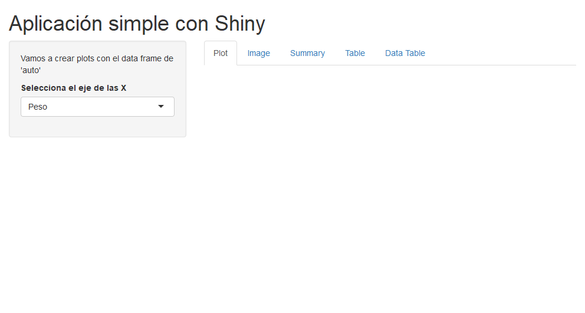

# Esto es una web app de Shiny

```{r, echo=FALSE}
library(knitr)
library(webshot)
knitr::include_app("http://127.0.0.1:5843",height = 1000)

appshot(app = "../IntroShinyWebApp/",file = "shiny.png",
        vheight = 400)

```

# Mostrar código de los chunks

```{r eval=TRUE}
knitr::read_chunk("../IntroShinyWebApp/ui.R")
```

```{r ui, eval=F}

```
